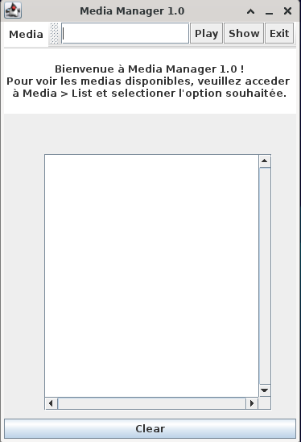
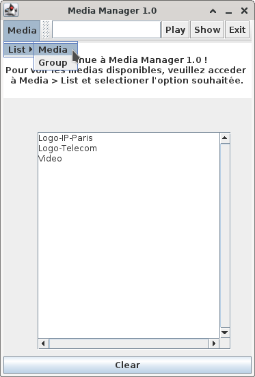
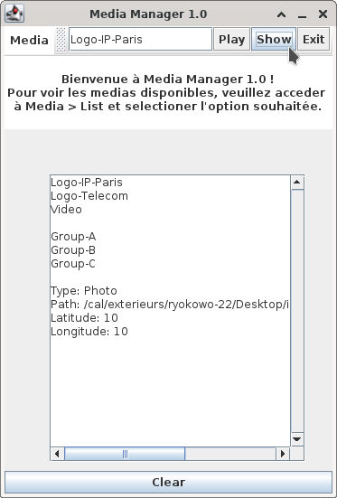
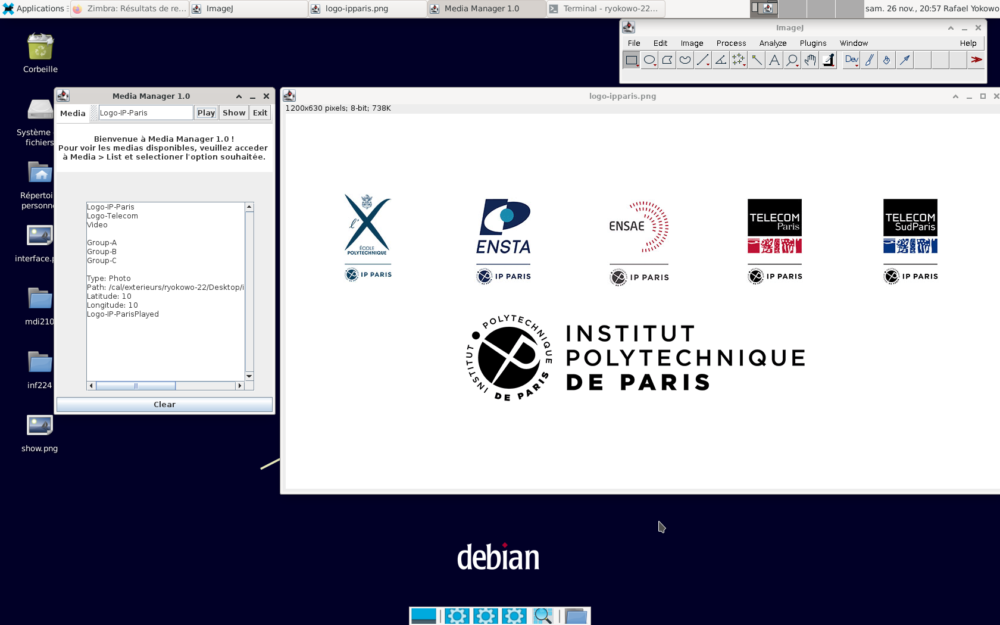

# INF224 - Paradigmes de programmation, théorie et pratique

## Introduction

Le but de ce projet est de créer l'ébauche du logiciel d'une set-top box multimédia permettant de jouer de la musique, des vidéos, des films, d'afficher des photos, etc. Ce logiciel sera realisé par étapes, en se limitant à la déclaration et l'implémentation de quelques classes et fonctionnalités typiques que l'on complétera progressivement.

## Configuration

Ce projet a été divisé en deux parties principales: backend et frontend. Le premier vise à créer toutes les classes qui sont relacionées aux medias ainsi que la structure du serveur auquel le client se communiquera. Ensuite, le deuxieme est responsable pour l'interface du client dans laquelle un utilisateur peut lister les medias disponibles, les jouer et voir leurs informations.

Afin de le mettre en fonctionnement, il faut suivre la consigne suivante:

- À partir du dossier _inf224_, ouvrez deux onglets du terminal;
- Ensuite, faites: 

    *cd backend && make* dans le premier onglet

    *cd frontend && make* dans le deuxieme onglet

- Finalement, faites la commande _make run_ dans l'onglet du backend et après dans l'onglet du frontend (il faut suivre cette ordre).

## Les réponses aux questions posées

### 5eme étape (C++)
Pour ce faire créer dans main.cpp un tableau dont les éléments sont tantôt une photo tantôt une vidéo. Ecrire ensuite une boucle permettant d'afficher les attributs de tous les élements du tableau ou de les "jouer". Cette boucle doit traiter tous les objets dérivant de la classe de base de la même manière.

- Quelle est la propriété caractéristique de l'orienté objet qui permet de faire cela ?

    Le polymorphisme.

- Qu'est-il spécifiquement nécessaire de faire dans le cas du C++ ?

    Au début, j'ai pensé que si on créait un array de Media, cela marcherait. Cependant, il fallait créer un array de pointeurs pour que les differents objets (Photo, Video etc.) puissent être référencés.

- Quel est le type des éléments du tableau : le tableau doit-il contenir des objets ou des pointeurs vers ces objets ? Pourquoi ? Comparer à Java.

    Le tableau doit contenir des pointeurs vers les objets car ce n'est pas possible de mélanger le polymorphisme et les arrays.

### 8eme étape (C++)

- Le groupe ne doit pas détruire les objets quand il est détruit car un objet peut appartenir à plusieurs groupes (on verra ce point à la question suivante). On rappelle aussi que la liste d'objets doit en fait être une liste de pointeurs d'objets. Pourquoi ? Comparer à Java.

    Dans le cas où la liste est faite avec des pointeurs, l'appel à un destructeur fait que les pointés ne soient pas détruits, seulement les pointeurs. De sorte qu'on peut conserver des objets (représentant des pointés) qui peuvent appartenir à d'autres groupes.

    En java, les objets non référencés sont automatiquement détruits par le ramasse-miettes. Donc, tant qu'il existe une référence à l'objet dans le programme, il ne sera pas détruit par erreur.

### 10eme étape (C++)

- Les méthodes précédentes permettent d'assurer la cohérence de la base de données car quand on crée un objet on l'ajoute à la table adéquate. Par contre, ce ne sera pas le cas si on crée un objet directement avec new (il n'appartiendra à aucune table). Comment peut-on l'interdire, afin que seule la classe servant à manipuler les objets puisse en créer de nouveaux ?

    Une manière de restreindre la création d'objets d'une classe est de rendre son constructeur privé, permettant son accès à une autre classe en utilisant la tag _friend_.

### Screenshots

- L'interface

- La liste de media

- Afficher des medias

- Jouer des medias

